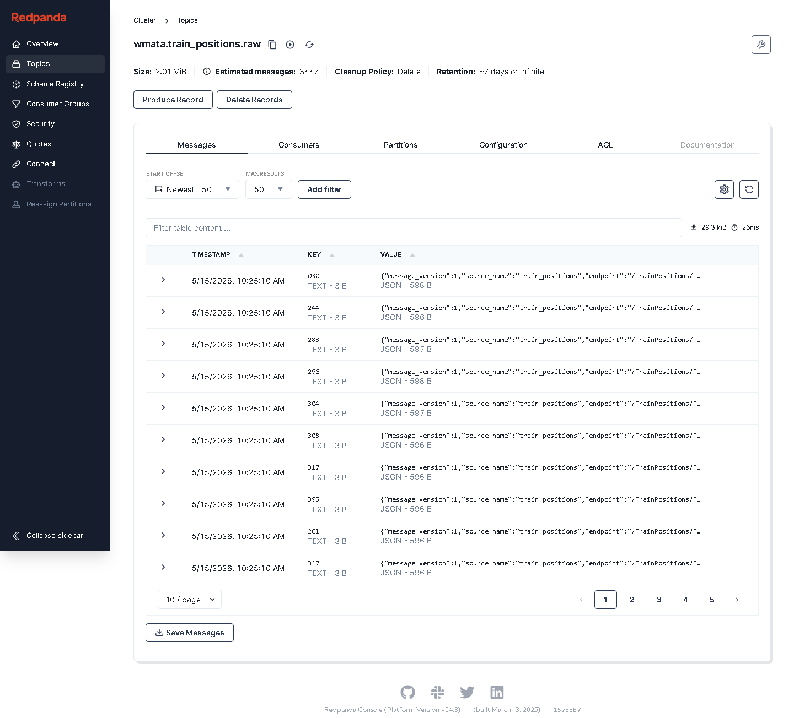
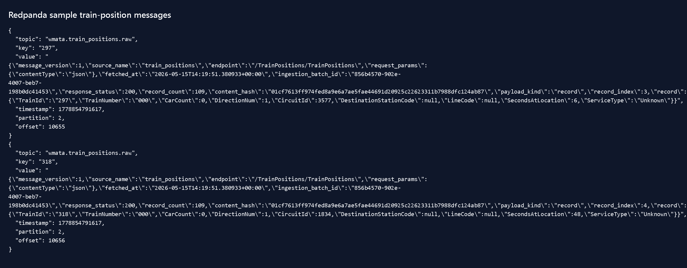
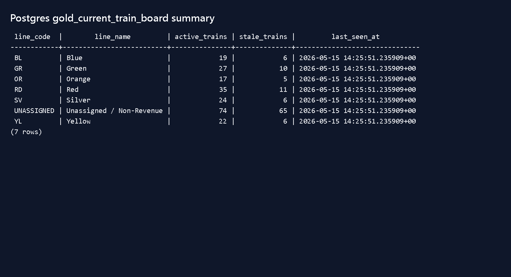

# Demo Run Evidence

This page captures a local V2 run of the WMATA streaming pipeline. The goal is to show that the
project was run end to end, not just described architecturally.

Run date: May 15, 2026

Local stack:

- WMATA APIs
- Python Kafka producer
- Redpanda/Kafka
- Spark Structured Streaming
- PostgreSQL
- Streamlit

## Service Status

The V2 services were started with Docker Compose:

```powershell
docker compose up -d --build postgres redpanda redpanda-init redpanda-console spark-reference-stream spark-train-stream dashboard
python -m transit_reliability.db_migrate
docker compose up -d --build producer
```

Running services:

```text
dashboard                Up, http://127.0.0.1:8501
postgres                 Up, healthy, localhost:55432
redpanda                 Up, healthy, localhost:19092
redpanda-console         Up, http://127.0.0.1:8080
spark-reference-stream   Up
spark-train-stream       Up
producer                 Up
```

## Row Counts

`scripts/check_counts.ps1` output from the local run:

```text
bronze_wmata_train_positions: 54891
silver_train_position_events: 58392
gold_current_train_board: 238
gold_line_activity_history: 511
gold_feed_health_history: 1652
```

## Benchmark

Command:

```powershell
.\scripts\benchmark_v2.ps1 -DurationMinutes 30 -SampleIntervalSeconds 30
```

Result:

```text
Benchmark result
----------------
Run date: 2026-05-15
Elapsed seconds:          1,803
Bronze rows ingested:     18,845
Silver records produced:  18,845
Silver records / second:  10.45
Line history rows added:  210
Feed history rows added:  700
Latest silver lag seconds at end: 11
```

Corrected dashboard freshness query after the run:

```text
 board_rows | fresh_rows | stale_rows | fresh_p50_seconds | fresh_p95_seconds | latest_board_lag_seconds
------------+------------+------------+-------------------+-------------------+--------------------------
        237 |        106 |        131 |                 9 |                 9 |                        9
(1 row)
```

Dashboard freshness P50/P95 is calculated for rows currently marked fresh. Stale rows are tracked
separately as reliability evidence instead of being folded into the freshness latency number.

Saved summary:
[`demo_artifacts/benchmark_v2_30min_summary.txt`](demo_artifacts/benchmark_v2_30min_summary.txt).

## Streamlit Dashboard


## Redpanda Console

Topic list and `wmata.train_positions.raw` view:



Sample message evidence is also saved in
[`demo_artifacts/redpanda_train_position_messages.txt`](demo_artifacts/redpanda_train_position_messages.txt).

Rendered sample:



Topic metadata:

```text
NAME                       PARTITIONS  REPLICAS
wmata.lines.raw            1           1
wmata.standard_routes.raw  1           1
wmata.stations.raw         1           1
wmata.train_positions.raw  3           1
```

## Postgres Gold Table Evidence

Gold query:

```sql
SELECT
    line_code,
    line_name,
    active_trains,
    stale_trains,
    last_seen_at
FROM (
    SELECT
        line_code,
        line_name,
        count(*) active_trains,
        count(*) FILTER (WHERE freshness_status = 'stale') stale_trains,
        max(last_seen_at) last_seen_at
    FROM gold_current_train_board
    GROUP BY line_code, line_name
) s
ORDER BY line_code;
```

Output:

```text
 line_code  |        line_name         | active_trains | stale_trains |         last_seen_at
------------+--------------------------+---------------+--------------+-------------------------------
 BL         | Blue                     |            19 |            6 | 2026-05-15 14:25:30.647767+00
 GR         | Green                    |            27 |           10 | 2026-05-15 14:25:30.647767+00
 OR         | Orange                   |            17 |            5 | 2026-05-15 14:25:30.647767+00
 RD         | Red                      |            35 |           11 | 2026-05-15 14:25:30.647767+00
 SV         | Silver                   |            24 |            6 | 2026-05-15 14:25:30.647767+00
 UNASSIGNED | Unassigned / Non-Revenue |            74 |           65 | 2026-05-15 14:25:30.647767+00
 YL         | Yellow                   |            22 |            6 | 2026-05-15 14:25:30.647767+00
(7 rows)
```

Rendered query output:



## Notes

- This is a local Docker demo, not a production throughput benchmark.
- WMATA train-position volume is modest, so the point of the run is operational proof, not raw scale.
- The benchmark numbers should be refreshed whenever the dashboard or streaming sink behavior changes.
